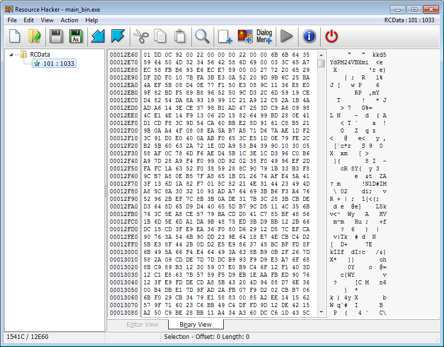
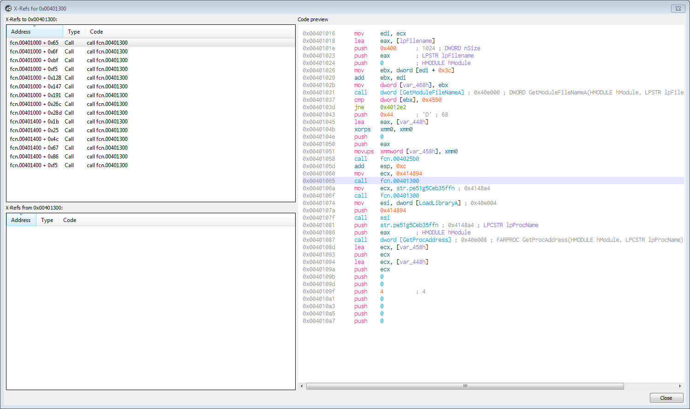
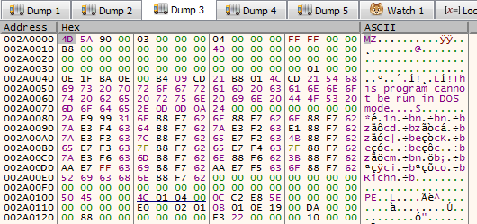
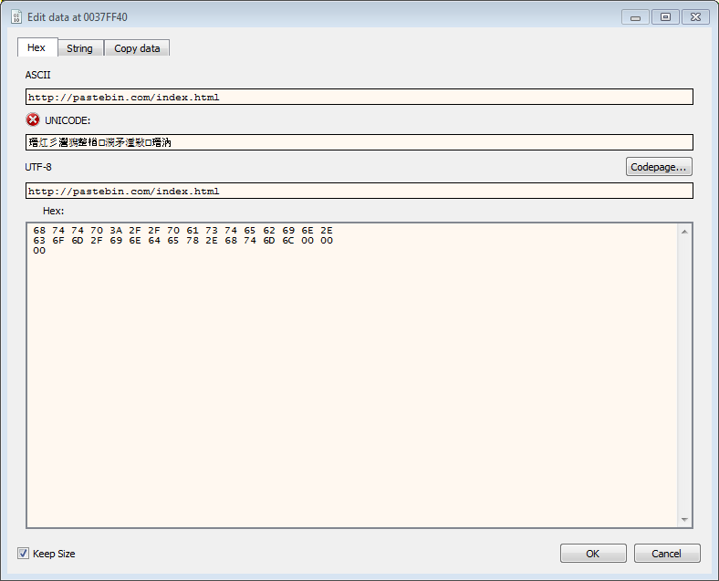
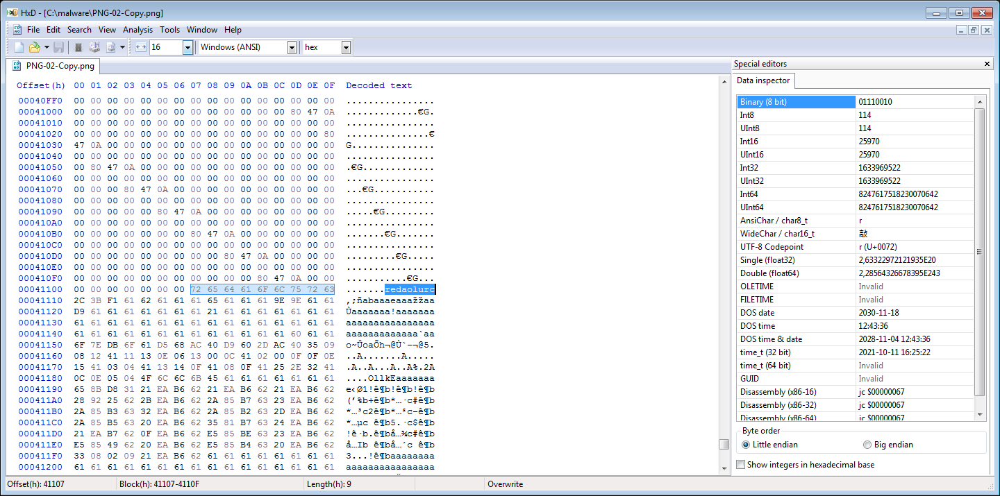
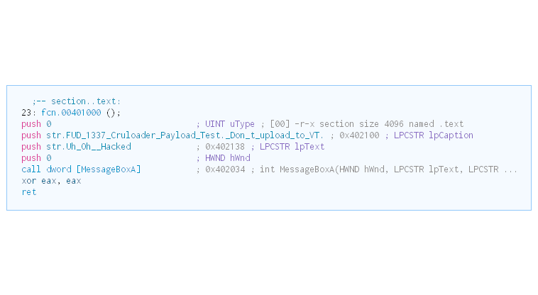

# Zero2Auto custom sample analysis


```
Short summary report for the IR Team

The suspicous sample the IR team found on an infected machine has the following functionality:
Spawns and injects itself into svhost.exe process to try and hide it's presence on the system
Acts like a downloader for additional malicous code
Uses legitimate webservices like Pastebin to get the next download stage to stay under the radar
Hides additional downloaded payloads in .PNG files, possibly to bypass FW/EDR/AV solutions
The final stage of the malicous code indicates the infected client has been "Uh Oh Hacked"
I've attached the following Yara rule to this email,
that can help the IR team to find client(s) infected with this malware.

rule Zero_2_Auto_CruLoader
{
	meta:
	    author="daevlin"
	    description="Zero2Auto CruLoader"
	    reference="https://courses.zero2auto.com/"
    strings:
        $cruloader_pdb = "Cruloader_Payload.pdb" wide ascii
        $cruloader_string = "cruloader" wide ascii


    condition:
        ($cruloader_pdb  or $cruloader_string)
}

Host based IOCs:
Any svhost.exe processes with the wrong PPID which have been started without the -k switch
The existance of the folder %TEMP%\\cruloader" with the file "output.jpg"

Network based IOC:s
https://pastebin.com/raw/mLem9DGk
https://i.ibb.co/KsfqHym/PNG-02-Copy.png
Browser User-Agent: cruloader

```


### Detailed analysis of the custom sample from the chapter "Practical Analysis and Test

Tools used. "rabin2, rahex2, Resource Hacker, DiE, Cutter, x32dbg, Python, Inetsim, PE-Bear"

We start by getting a hash of the file

1) Sample SHA256: 
a0ac02a1e6c908b90173e86c3e321f2bab082ed45236503a21eb7d984de10611  main_bin.exe

File seems to be compiled Sun Jun 21 16:12:38 2020. Seems to be no indication of time stomping.

Looking at the hash on VT we can see that we get some hits

Scanned on : 
	2020-06-21 14:15:51

Detections:
	 24/72 Positives/Total

	Results for MD5    : a84e1256111e4e235250a8e3bb11f903
	Results for SHA1   : 1b76e5a645a0df61bb4569d54bd1183ab451c95e
	Results for SHA256 : a0ac02a1e6c908b90173e86c3e321f2bab082ed45236503a21eb7d984de10611

	Permanent Link : https://www.virustotal.com/gui/file/a0ac02a1e6c908b90173e86c3e321f2bab082ed45236503a21eb7d984de10611/detection/f-a0ac02a1e6c908b90173e86c3e321f2bab082ed45236503a21eb7d984de10611-1592748951

Which is a indicator that the sample might be malicous

Looking at the imports with rabin2 -i main_bin.exe we can see that the sample import the following API calls:

```

[Imports]
ordinal=001 plt=0x00000000 bind=NONE type=FUNC name=KERNEL32.dll_GetModuleFileNameA
ordinal=002 plt=0x00000000 bind=NONE type=FUNC name=KERNEL32.dll_LoadLibraryA
ordinal=003 plt=0x00000000 bind=NONE type=FUNC name=KERNEL32.dll_GetProcAddress
ordinal=004 plt=0x00000000 bind=NONE type=FUNC name=KERNEL32.dll_WriteConsoleW
ordinal=005 plt=0x00000000 bind=NONE type=FUNC name=KERNEL32.dll_UnhandledExceptionFilter
ordinal=006 plt=0x00000000 bind=NONE type=FUNC name=KERNEL32.dll_SetUnhandledExceptionFilter
ordinal=007 plt=0x00000000 bind=NONE type=FUNC name=KERNEL32.dll_GetCurrentProcess
ordinal=008 plt=0x00000000 bind=NONE type=FUNC name=KERNEL32.dll_TerminateProcess
ordinal=009 plt=0x00000000 bind=NONE type=FUNC name=KERNEL32.dll_IsProcessorFeaturePresent
ordinal=010 plt=0x00000000 bind=NONE type=FUNC name=KERNEL32.dll_QueryPerformanceCounter
ordinal=011 plt=0x00000000 bind=NONE type=FUNC name=KERNEL32.dll_GetCurrentProcessId
ordinal=012 plt=0x00000000 bind=NONE type=FUNC name=KERNEL32.dll_GetCurrentThreadId
ordinal=013 plt=0x00000000 bind=NONE type=FUNC name=KERNEL32.dll_GetSystemTimeAsFileTime
ordinal=014 plt=0x00000000 bind=NONE type=FUNC name=KERNEL32.dll_InitializeSListHead
ordinal=015 plt=0x00000000 bind=NONE type=FUNC name=KERNEL32.dll_IsDebuggerPresent
ordinal=016 plt=0x00000000 bind=NONE type=FUNC name=KERNEL32.dll_GetStartupInfoW
ordinal=017 plt=0x00000000 bind=NONE type=FUNC name=KERNEL32.dll_GetModuleHandleW
ordinal=018 plt=0x00000000 bind=NONE type=FUNC name=KERNEL32.dll_RtlUnwind
ordinal=019 plt=0x00000000 bind=NONE type=FUNC name=KERNEL32.dll_GetLastError
ordinal=020 plt=0x00000000 bind=NONE type=FUNC name=KERNEL32.dll_SetLastError
ordinal=021 plt=0x00000000 bind=NONE type=FUNC name=KERNEL32.dll_EnterCriticalSection
ordinal=022 plt=0x00000000 bind=NONE type=FUNC name=KERNEL32.dll_LeaveCriticalSection
ordinal=023 plt=0x00000000 bind=NONE type=FUNC name=KERNEL32.dll_DeleteCriticalSection
ordinal=024 plt=0x00000000 bind=NONE type=FUNC name=KERNEL32.dll_InitializeCriticalSectionAndSpinCount
ordinal=025 plt=0x00000000 bind=NONE type=FUNC name=KERNEL32.dll_TlsAlloc
ordinal=026 plt=0x00000000 bind=NONE type=FUNC name=KERNEL32.dll_TlsGetValue
ordinal=027 plt=0x00000000 bind=NONE type=FUNC name=KERNEL32.dll_TlsSetValue
ordinal=028 plt=0x00000000 bind=NONE type=FUNC name=KERNEL32.dll_TlsFree
ordinal=029 plt=0x00000000 bind=NONE type=FUNC name=KERNEL32.dll_FreeLibrary
ordinal=030 plt=0x00000000 bind=NONE type=FUNC name=KERNEL32.dll_LoadLibraryExW
ordinal=031 plt=0x00000000 bind=NONE type=FUNC name=KERNEL32.dll_RaiseException
ordinal=032 plt=0x00000000 bind=NONE type=FUNC name=KERNEL32.dll_GetStdHandle
ordinal=033 plt=0x00000000 bind=NONE type=FUNC name=KERNEL32.dll_WriteFile
ordinal=034 plt=0x00000000 bind=NONE type=FUNC name=KERNEL32.dll_GetModuleFileNameW
ordinal=035 plt=0x00000000 bind=NONE type=FUNC name=KERNEL32.dll_ExitProcess
ordinal=036 plt=0x00000000 bind=NONE type=FUNC name=KERNEL32.dll_GetModuleHandleExW
ordinal=037 plt=0x00000000 bind=NONE type=FUNC name=KERNEL32.dll_GetCommandLineA
ordinal=038 plt=0x00000000 bind=NONE type=FUNC name=KERNEL32.dll_GetCommandLineW
ordinal=039 plt=0x00000000 bind=NONE type=FUNC name=KERNEL32.dll_HeapAlloc
ordinal=040 plt=0x00000000 bind=NONE type=FUNC name=KERNEL32.dll_HeapFree
ordinal=041 plt=0x00000000 bind=NONE type=FUNC name=KERNEL32.dll_FindClose
ordinal=042 plt=0x00000000 bind=NONE type=FUNC name=KERNEL32.dll_FindFirstFileExW
ordinal=043 plt=0x00000000 bind=NONE type=FUNC name=KERNEL32.dll_FindNextFileW
ordinal=044 plt=0x00000000 bind=NONE type=FUNC name=KERNEL32.dll_IsValidCodePage
ordinal=045 plt=0x00000000 bind=NONE type=FUNC name=KERNEL32.dll_GetACP
ordinal=046 plt=0x00000000 bind=NONE type=FUNC name=KERNEL32.dll_GetOEMCP
ordinal=047 plt=0x00000000 bind=NONE type=FUNC name=KERNEL32.dll_GetCPInfo
ordinal=048 plt=0x00000000 bind=NONE type=FUNC name=KERNEL32.dll_MultiByteToWideChar
ordinal=049 plt=0x00000000 bind=NONE type=FUNC name=KERNEL32.dll_WideCharToMultiByte
ordinal=050 plt=0x00000000 bind=NONE type=FUNC name=KERNEL32.dll_GetEnvironmentStringsW
ordinal=051 plt=0x00000000 bind=NONE type=FUNC name=KERNEL32.dll_FreeEnvironmentStringsW
ordinal=052 plt=0x00000000 bind=NONE type=FUNC name=KERNEL32.dll_SetEnvironmentVariableW
ordinal=053 plt=0x00000000 bind=NONE type=FUNC name=KERNEL32.dll_SetStdHandle
ordinal=054 plt=0x00000000 bind=NONE type=FUNC name=KERNEL32.dll_GetFileType
ordinal=055 plt=0x00000000 bind=NONE type=FUNC name=KERNEL32.dll_GetStringTypeW
ordinal=056 plt=0x00000000 bind=NONE type=FUNC name=KERNEL32.dll_CompareStringW
ordinal=057 plt=0x00000000 bind=NONE type=FUNC name=KERNEL32.dll_LCMapStringW
ordinal=058 plt=0x00000000 bind=NONE type=FUNC name=KERNEL32.dll_GetProcessHeap
ordinal=059 plt=0x00000000 bind=NONE type=FUNC name=KERNEL32.dll_HeapSize
ordinal=060 plt=0x00000000 bind=NONE type=FUNC name=KERNEL32.dll_HeapReAlloc
ordinal=061 plt=0x00000000 bind=NONE type=FUNC name=KERNEL32.dll_FlushFileBuffers
ordinal=062 plt=0x00000000 bind=NONE type=FUNC name=KERNEL32.dll_GetConsoleOutputCP
ordinal=063 plt=0x00000000 bind=NONE type=FUNC name=KERNEL32.dll_GetConsoleMode
ordinal=064 plt=0x00000000 bind=NONE type=FUNC name=KERNEL32.dll_SetFilePointerEx
ordinal=065 plt=0x00000000 bind=NONE type=FUNC name=KERNEL32.dll_CreateFileW
ordinal=066 plt=0x00000000 bind=NONE type=FUNC name=KERNEL32.dll_CloseHandle
ordinal=067 plt=0x00000000 bind=NONE type=FUNC name=KERNEL32.dll_DecodePointer

```

Looking at the sections of the binary with the following command "rabin2 -S main_bin.exe" 

```

[Sections]
idx=00 addr=0x00000400 off=0x00000400 sz=50688 vsz=50335 perm=-r-x name=.text
idx=01 addr=0x0000ca00 off=0x0000ca00 sz=23040 vsz=23002 perm=-r-- name=.rdata
idx=02 addr=0x00012400 off=0x00012400 sz=2560 vsz=5028 perm=-rw- name=.data
idx=03 addr=0x00012e00 off=0x00012e00 sz=87552 vsz=87168 perm=-r-- name=.rsrc
idx=04 addr=0x00028400 off=0x00028400 sz=4096 vsz=3768 perm=-r-- name=.reloc

```
What sticks out in this case is that the .rsrc section is quite big, but there are no calls to any API calls to access it, for example:

```
SizeofResource
FindResourceA
LockResource
LoadResource 

```

DiE does not indicate that the sample is packed with a known packer. But hiding API calls and the big .rsrc makes me have a theory that it is. I just have to prove it somehow.

diec main_bin.exe 
PE: compiler: Microsoft Visual C/C++(-)[-]
PE: linker: Microsoft Linker(14.25)[EXE32,console]

Looking at the file in "Resource Hacker". There is a RT_RCDATA resource with ID 101. The .rsrc is kind of big, 86 KB to be exact and seems to contains random bytes, which may indicate it's packed or encrypted/obfuscated.



The .rsrc section also has quite a high entry, as shown by the diagram in DiE.


Let's do some analysis of the suspicous binary in Cutter. What immediatly peaks my interest is what looks like a lookup table in the Strings pane in Cutter. "abcdefghijklmnopqrstuvwxyzABCDEFGHIJKLMNOPQRSTUVWXYZ01234567890./="

Looking a xrefs to the strings we come to this



The decompiled the function looks like this in Cutter:

```c
void __fastcall fcn.00401300(char *param_1)
{
    char cVar1;
    char cVar2;
    int32_t iVar3;
    int32_t *piVar4;
    char *pcVar5;
    int32_t iVar6;
    int32_t iVar7;
    int32_t var_4ch;
    int32_t var_48h;
    int32_t var_38h;
    int32_t var_28h;
    int32_t var_18h;
    int32_t var_8h;
    int32_t var_4h;
    
    iVar7 = 0;
    pcVar5 = param_1;
    do {
        cVar1 = *pcVar5;
        pcVar5 = pcVar5 + 1;
    } while (cVar1 != '\0');
    if (pcVar5 != param_1 + 1 && -1 < (int32_t)(pcVar5 + -(int32_t)(param_1 + 1))) {
        do {
            cVar1 = param_1[iVar7];
            var_48h = "abcdefghijklmnopqrstuvwxyzABCDEFGHIJKLMNOPQRSTUVWXYZ01234567890./="._0_4_;
            cVar2 = fcn.004038f4(1);
            iVar3 = fcn.00402190(&var_48h, (int32_t)cVar1);
            if (iVar3 != 0) {
                piVar4 = &var_48h;
                iVar3 = iVar3 - (int32_t)piVar4;
                do {
                    cVar1 = *(char *)piVar4;
                    piVar4 = (int32_t *)((int32_t)piVar4 + 1);
                } while (cVar1 != '\0');
                piVar4 = (int32_t *)((int32_t)piVar4 - ((int32_t)&var_48h + 1));
                iVar6 = iVar3 + 0xd;
                if ((int32_t)piVar4 <= iVar6) {
                    iVar6 = (iVar3 - (int32_t)piVar4) + 0xd;
                }
                cVar2 = *(char *)((int32_t)&var_48h + iVar6);
            }
            param_1[iVar7] = cVar2;
            iVar7 = iVar7 + 1;
            pcVar5 = param_1;
            do {
                cVar1 = *pcVar5;
                pcVar5 = pcVar5 + 1;
            } while (cVar1 != '\0');
        } while (iVar7 < (int32_t)(pcVar5 + -(int32_t)(param_1 + 1)));
    }
    fcn.0040163b((int32_t)param_1);
    return;
}

```

Before each call to GetProcAddress the fcn.00401300 is called. Let's assume that fcn.00401300 is our decryption function for now.

```c
void __fastcall fcn.00401000(int32_t param_1)
{
    undefined4 uVar1;
    code *pcVar2;
    int32_t iVar3;
    undefined4 *puVar4;
    code *pcVar5;
    code *pcVar6;
    int32_t iVar7;
    int32_t *piVar8;
    int32_t iVar9;
    int32_t iVar10;
    int32_t unaff_EDI;
    int32_t var_470h;
    undefined4 var_46ch;
    int32_t var_468h;
    undefined4 var_464h;
    undefined4 var_460h;
    int32_t var_45ch;
    int32_t var_458h;
    int32_t var_454h;
    int32_t var_448h;
    undefined4 lpFilename;
    int32_t var_4h;
    
    piVar8 = (int32_t *)(*(int32_t *)(param_1 + 0x3c) + param_1);
    (*_GetModuleFileNameA)(0, &lpFilename, 0x400);
    if (*piVar8 == 0x4550) {
        _var_458h = ZEXT816(0);
        fcn.004025b0(&var_448h, 0, 0x44);
        fcn.00401300();
        fcn.00401300();
        pcVar5 = _LoadLibraryA;
        uVar1 = (*_LoadLibraryA)(0x414894);
        pcVar2 = (code *)(*_GetProcAddress)(uVar1, "pe51g5Ceb35ffn");
        iVar3 = (*pcVar2)(&lpFilename, 0, 0, 0, 0, 4, 0, 0, &var_448h, &var_458h);
        if (iVar3 != 0) {
            fcn.00401300();
            uVar1 = (*pcVar5)(0x414894);
            pcVar2 = (code *)(*_GetProcAddress)(uVar1, 0x4148e8);
            puVar4 = (undefined4 *)(*pcVar2)(0, 4, 0x1000, 4);
            *puVar4 = 0x10007;
            fcn.00401300();
            uVar1 = (*pcVar5)(0x414894);
            pcVar2 = (code *)(*_GetProcAddress)(uVar1, "t5gG8e514pbag5kg");
            iVar3 = (*pcVar2)(var_454h, puVar4);
            if (iVar3 != 0) {
                fcn.00401300();
                uVar1 = (*pcVar5)(0x414894);
                pcVar5 = (code *)(*_GetProcAddress)(uVar1, "E514Ceb35ffz5=bel");
                fcn.00401300();
                uVar1 = (*_LoadLibraryA)(0x414894);
                pcVar2 = (code *)(*_GetProcAddress)(uVar1, "Je9g5Ceb35ffz5=bel");
                (*pcVar5)(var_458h, puVar4[0x29] + 8, &var_45ch, 4, 0);
                fcn.00401300();
                uVar1 = (*_LoadLibraryA)(0x414894);
                pcVar5 = _GetProcAddress;
                pcVar6 = (code *)(*_GetProcAddress)(uVar1, "I9egh1/n//b3rk");
                iVar3 = (*pcVar6)(var_458h, piVar8[0xd], piVar8[0x14], 0x3000, 0x40);
                (*pcVar2)(var_458h, iVar3, param_1, piVar8[0x15], 0);
                iVar9 = 0;
                if (*(int16_t *)((int32_t)piVar8 + 6) != 0) {
                    iVar10 = 0;
                    do {
                        iVar7 = *(int32_t *)(param_1 + 0x3c) + iVar10;
                        (*pcVar2)(var_458h, *(int32_t *)(iVar7 + 0x104 + param_1) + iVar3, 
                                  *(int32_t *)(iVar7 + 0x10c + param_1) + param_1, 
                                  *(undefined4 *)(iVar7 + 0x108 + param_1), 0);
                        iVar9 = iVar9 + 1;
                        iVar10 = iVar10 + 0x28;
                        pcVar5 = _GetProcAddress;
                    } while (iVar9 < (int32_t)(uint32_t)*(uint16_t *)((int32_t)piVar8 + 6));
                }
                (*pcVar2)(var_458h, puVar4[0x29] + 8, piVar8 + 0xd, 4, 0);
                fcn.00401300();
                pcVar2 = _LoadLibraryA;
                uVar1 = (*_LoadLibraryA)(0x414894);
                pcVar6 = (code *)(*pcVar5)(uVar1, "F5gG8e514pbag5kg");
                fcn.00401300();
                iVar9 = (*pcVar2)(0x414894);
                pcVar5 = (code *)(*pcVar5)(iVar9, "E5fh=5G8e514");
                puVar4[0x2c] = piVar8[10] + iVar3;
                (*pcVar6)(var_454h, puVar4);
                (*pcVar5)(var_454h);
                fcn.0040163b(iVar9);
                return;
            }
        }
    }
    fcn.0040163b(unaff_EDI);
    return;
    }
```


Looking at this iVar6 = iVar3 + 0xd; (0xd = 13) I have a sneaking suspicion that it is using ROT13 encoding.
But lets fire up x32dbg and put a BP 00401300, to further analyse it and verify this theory.

Our encrypted strings

```

00000000  F5gG8e514pbag5kg
00000014  .5ea5/QPY4//
00000024  pe51g5Ceb35ffn
00000034  I9egh1/n//b3rk
00000044  E5fh=5G8e514
00000054  Je9g5Ceb35ffz5=bel
00000068  I9egh1/n//b3
00000078  E514Ceb35ffz5=bel
0000008C  t5gG8e514pbag5kg
000000A0  .5ea5/QPY4//
000000B0  F9m5b6E5fbhe35
000000C0  s9a4E5fbhe35n
000000D0  I9egh1/n//b3
000000E0  yb3.E5fbhe35
000000F0  yb14E5fbhe35

```

Our first encrypted strings

```

.5ea5/QPY4//

```

Imma gonna need a quantum computer to crack this!

If we take the . and rotate 13 chars according to the lookup table (abcdefghijklmnopqrstuvwxyzABCDEFGHIJKLMNOPQRSTUVWXYZ01234567890./=) we end up on k. If we take the second char "5" and rotate 13, we get e, then e becomes r and so on and so forth.

```

.5ea5/QPY4// becomes kernel32.dll

```

After the API calls to get the RC4 enrypted .rsrc section are deobfuscated it will call the following API calls:

```
SizeofResource
FindResourceA
VirtualAlloc
LockResource
LoadResource

```

If we set BP on LockResource, and let it hit (and return to user code), the address of the resource that it wans to read should be in the EAX register.
It will then call VirtualAlloc to assign a memory region for the resource.

After the memory area is allocated, we come across sometthing that looks a lot like RC4 encryption (hint cmp eax, 100).

```c
    iVar12 = 0;
    do {
        *(char *)((int32_t)&var_108h + iVar12) = (char)iVar12;
        iVar12 = iVar12 + 1;
    } while (iVar12 < 0x100);
    uVar9 = 0;
    do {
        cVar1 = *(char *)((int32_t)&var_108h + uVar9);
        uVar14 = uVar14 + *(char *)(uVar9 % 0xf + 0xc + iVar10) + cVar1;
        *(char *)((int32_t)&var_108h + uVar9) = *(char *)((int32_t)&var_108h + (uint32_t)uVar14);
        uVar9 = uVar9 + 1;
        *(char *)((int32_t)&var_108h + (uint32_t)uVar14) = cVar1;
    } while ((int32_t)uVar9 < 0x100);
    iVar10 = 0;
    if (0 < iVar2) {
        do {
            var_8h._0_1_ = (uint8_t)var_8h + 1;
            pcVar13 = (char *)((int32_t)&var_108h + (uint32_t)(uint8_t)var_8h);
            cVar1 = *pcVar13;
            var_8h._1_1_ = var_8h._1_1_ + cVar1;
            *pcVar13 = *(char *)((int32_t)&var_108h + (uint32_t)var_8h._1_1_);
            *(char *)((int32_t)&var_108h + (uint32_t)var_8h._1_1_) = cVar1;
            *(uint8_t *)(iVar10 + iVar11) =
                 *(uint8_t *)(iVar10 + iVar11) ^
                 *(uint8_t *)((int32_t)&var_108h + (uint32_t)(uint8_t)(*pcVar13 + cVar1));
            iVar10 = iVar10 + 1;
        } while (iVar10 < iVar2);
    }
```

EDI = size of encrypted data in hex 
edi=00015400 (87040 bytes)

If we look at this instruction in x32dbg we can see the RC4 key.

00401592 | 0FB64438 0C              | movzx eax,byte ptr ds:[eax+edi+C]       | eax+edi*1+C:"kkd5YdPM24VBXmi"

EAX = 0 (start of our rsrc section)
EDI = .rsrc section at address 00416060 + C
    
We can validate this by starting up HxD to check the key and the data after it
    


Our RC4 key is at offset C (12 bytes in)

With that knowledge, we should at least be able to make a Python script to unpack the first Stage of CruLoader.

But we still wanna know what it does, since we can see in the decompiled code that there are a few other encrypted strings which have not been decrypted yet.

If the let the decryption routine finish on the newly allocted memory region we can see a decrypted MZ binary. 



After the .rsrc has been decrypted, it goes back to resoöving some more encrypted API calls. The calls are the following:
```
00000001  SetThreadContext
00000025  CreateProcessA
00000035  VirtualAllocEx
00000045  ResumeThread
00000055  WriteProcessMemory
00000069  VirtualAlloc
00000079  ReadProcessMemory
0000008D  GetThreadContext
```

It then calls this API to spawn a suspended copy of itself. This is starting to look like it will write the unpacked payload to a new child process.


**Cruloaders second layer**

So. With that, let's look at the unpacked/decrypted payload we dumped out earlier to see what this second stage does.

Imports of our unpacked payload does not look that suspicous

rabin2.exe -i unpacked_cruloader.exe

```
[Imports]
Num  Vaddr       Bind      Type Name
   1 0x0040f000    NONE    FUNC KERNEL32.dll_LoadLibraryA
   2 0x0040f004    NONE    FUNC KERNEL32.dll_GetProcAddress
   3 0x0040f008    NONE    FUNC KERNEL32.dll_VirtualFree
   4 0x0040f00c    NONE    FUNC KERNEL32.dll_VirtualAlloc
   5 0x0040f010    NONE    FUNC KERNEL32.dll_GetLastError
   6 0x0040f014    NONE    FUNC KERNEL32.dll_GetModuleHandleW
   7 0x0040f018    NONE    FUNC KERNEL32.dll_GetModuleFileNameA
   8 0x0040f01c    NONE    FUNC KERNEL32.dll_lstrlenA
   9 0x0040f020    NONE    FUNC KERNEL32.dll_MultiByteToWideChar
  10 0x0040f024    NONE    FUNC KERNEL32.dll_CloseHandle
  11 0x0040f028    NONE    FUNC KERNEL32.dll_WriteConsoleW
  12 0x0040f02c    NONE    FUNC KERNEL32.dll_UnhandledExceptionFilter
  13 0x0040f030    NONE    FUNC KERNEL32.dll_SetUnhandledExceptionFilter
  14 0x0040f034    NONE    FUNC KERNEL32.dll_GetCurrentProcess
  15 0x0040f038    NONE    FUNC KERNEL32.dll_TerminateProcess
  16 0x0040f03c    NONE    FUNC KERNEL32.dll_IsProcessorFeaturePresent
  17 0x0040f040    NONE    FUNC KERNEL32.dll_QueryPerformanceCounter
  18 0x0040f044    NONE    FUNC KERNEL32.dll_GetCurrentProcessId
  19 0x0040f048    NONE    FUNC KERNEL32.dll_GetCurrentThreadId
  20 0x0040f04c    NONE    FUNC KERNEL32.dll_GetSystemTimeAsFileTime
  21 0x0040f050    NONE    FUNC KERNEL32.dll_InitializeSListHead
  22 0x0040f054    NONE    FUNC KERNEL32.dll_IsDebuggerPresent
  23 0x0040f058    NONE    FUNC KERNEL32.dll_GetStartupInfoW
  24 0x0040f05c    NONE    FUNC KERNEL32.dll_RtlUnwind
  25 0x0040f060    NONE    FUNC KERNEL32.dll_SetLastError
  26 0x0040f064    NONE    FUNC KERNEL32.dll_EnterCriticalSection
  27 0x0040f068    NONE    FUNC KERNEL32.dll_LeaveCriticalSection
  28 0x0040f06c    NONE    FUNC KERNEL32.dll_DeleteCriticalSection
  29 0x0040f070    NONE    FUNC KERNEL32.dll_InitializeCriticalSectionAndSpinCount
  30 0x0040f074    NONE    FUNC KERNEL32.dll_TlsAlloc
  31 0x0040f078    NONE    FUNC KERNEL32.dll_TlsGetValue
  32 0x0040f07c    NONE    FUNC KERNEL32.dll_TlsSetValue
  33 0x0040f080    NONE    FUNC KERNEL32.dll_TlsFree
  34 0x0040f084    NONE    FUNC KERNEL32.dll_FreeLibrary
  35 0x0040f088    NONE    FUNC KERNEL32.dll_LoadLibraryExW
  36 0x0040f08c    NONE    FUNC KERNEL32.dll_RaiseException
  37 0x0040f090    NONE    FUNC KERNEL32.dll_GetStdHandle
  38 0x0040f094    NONE    FUNC KERNEL32.dll_WriteFile
  39 0x0040f098    NONE    FUNC KERNEL32.dll_GetModuleFileNameW
  40 0x0040f09c    NONE    FUNC KERNEL32.dll_ExitProcess
  41 0x0040f0a0    NONE    FUNC KERNEL32.dll_GetModuleHandleExW
  42 0x0040f0a4    NONE    FUNC KERNEL32.dll_GetCommandLineA
  43 0x0040f0a8    NONE    FUNC KERNEL32.dll_GetCommandLineW
  44 0x0040f0ac    NONE    FUNC KERNEL32.dll_HeapFree
  45 0x0040f0b0    NONE    FUNC KERNEL32.dll_HeapAlloc
  46 0x0040f0b4    NONE    FUNC KERNEL32.dll_CompareStringW
  47 0x0040f0b8    NONE    FUNC KERNEL32.dll_LCMapStringW
  48 0x0040f0bc    NONE    FUNC KERNEL32.dll_GetFileType
  49 0x0040f0c0    NONE    FUNC KERNEL32.dll_FindClose
  50 0x0040f0c4    NONE    FUNC KERNEL32.dll_FindFirstFileExW
  51 0x0040f0c8    NONE    FUNC KERNEL32.dll_FindNextFileW
  52 0x0040f0cc    NONE    FUNC KERNEL32.dll_IsValidCodePage
  53 0x0040f0d0    NONE    FUNC KERNEL32.dll_GetACP
  54 0x0040f0d4    NONE    FUNC KERNEL32.dll_GetOEMCP
  55 0x0040f0d8    NONE    FUNC KERNEL32.dll_GetCPInfo
  56 0x0040f0dc    NONE    FUNC KERNEL32.dll_WideCharToMultiByte
  57 0x0040f0e0    NONE    FUNC KERNEL32.dll_GetEnvironmentStringsW
  58 0x0040f0e4    NONE    FUNC KERNEL32.dll_FreeEnvironmentStringsW
  59 0x0040f0e8    NONE    FUNC KERNEL32.dll_SetEnvironmentVariableW
  60 0x0040f0ec    NONE    FUNC KERNEL32.dll_SetStdHandle
  61 0x0040f0f0    NONE    FUNC KERNEL32.dll_GetStringTypeW
  62 0x0040f0f4    NONE    FUNC KERNEL32.dll_GetProcessHeap
  63 0x0040f0f8    NONE    FUNC KERNEL32.dll_FlushFileBuffers
  64 0x0040f0fc    NONE    FUNC KERNEL32.dll_GetConsoleOutputCP
  65 0x0040f100    NONE    FUNC KERNEL32.dll_GetConsoleMode
  66 0x0040f104    NONE    FUNC KERNEL32.dll_SetFilePointerEx
  67 0x0040f108    NONE    FUNC KERNEL32.dll_HeapSize
  68 0x0040f10c    NONE    FUNC KERNEL32.dll_HeapReAlloc
  69 0x0040f110    NONE    FUNC KERNEL32.dll_CreateFileW
  70 0x0040f114    NONE    FUNC KERNEL32.dll_DecodePointer
```

What about the sections? Nope

rabin2.exe -S unpacked_cruloader.exe
```
[Sections]
Nm Paddr       Size Vaddr      Memsz Perms Name
00 0x00000400 55808 0x00401000 57344 -r-x .text
01 0x0000de00 23552 0x0040f000 24576 -r-- .rdata
02 0x00013a00  2560 0x00415000  8192 -rw- .data
03 0x00014400  4096 0x00417000  4096 -r-- .reloc
```

DiE is not showing high entropy for any of the sections.

Looking at the strings in the binary, shows something intersting though, a string "cruloader" and a dll for which there are no API imports. Does it perhaps contain network functionality since there is a reference to wininet.dll? But where is the hostname/URL?
```
1062 0x00012a1c 0x00413c1c  12  13 (.rdata) ascii kernel32.dll
1063 0x00012a2c 0x00413c2c   9  10 (.rdata) ascii ntdll.dll
1064 0x00012a38 0x00413c38  11  12 (.rdata) ascii wininet.dll
```

Taking a quick look at it Cutter shows something suspicous. My favorite party trick, is to search for all XOR instructions.
One of them sticks out a bit (there a more, but we will get to those later)
```
xor ecx, 0xedb88320
xor edx, 0xedb88320
```
Before two of the calls to GetProcAddress, this function is called. I have a sneaking suspicion that the constant "0xedb88320" is used for something important. 
Googling on the constant "0xedb88320" indicates that it is used for CRC32 hashing.

There are 2 xrefs to this function at 0x00401660. We will look at the second use of it furher into the analysis.

```c
uint32_t __cdecl fcn.00401660(int32_t arg_8h)
{
    uint8_t uVar1;
    uint32_t uVar2;
    uint8_t *in_EDX;
    uint32_t uVar3;
    uint32_t uVar4;
    uint8_t *puVar5;
    
    if (*(int32_t *)0x41628c == 0) {
        uVar4 = 0;
        do {
            uVar3 = uVar4 >> 1 ^ 0xedb88320;
            if ((uVar4 & 1) == 0) {
                uVar3 = uVar4 >> 1;
            }
            uVar2 = uVar3 >> 1 ^ 0xedb88320;
            if ((uVar3 & 1) == 0) {
                uVar2 = uVar3 >> 1;
            }
            uVar3 = uVar2 >> 1 ^ 0xedb88320;
            if ((uVar2 & 1) == 0) {
                uVar3 = uVar2 >> 1;
            }
            uVar2 = uVar3 >> 1 ^ 0xedb88320;
            if ((uVar3 & 1) == 0) {
                uVar2 = uVar3 >> 1;
            }
            uVar3 = uVar2 >> 1 ^ 0xedb88320;
            if ((uVar2 & 1) == 0) {
                uVar3 = uVar2 >> 1;
            }
            uVar2 = uVar3 >> 1 ^ 0xedb88320;
            if ((uVar3 & 1) == 0) {
                uVar2 = uVar3 >> 1;
            }
            uVar3 = uVar2 >> 1 ^ 0xedb88320;
            if ((uVar2 & 1) == 0) {
                uVar3 = uVar2 >> 1;
            }
            uVar2 = uVar3 >> 1 ^ 0xedb88320;
            if ((uVar3 & 1) == 0) {
                uVar2 = uVar3 >> 1;
            }
            *(uint32_t *)(uVar4 * 4 + 0x416690) = uVar2;
            uVar4 = uVar4 + 1;
        } while ((int32_t)uVar4 < 0x100);
        *(int32_t *)0x41628c = 1;
    }
    uVar4 = 0xffffffff;
    puVar5 = in_EDX + arg_8h;
    if (in_EDX < puVar5) {
        do {
            uVar1 = *in_EDX;
            in_EDX = in_EDX + 1;
            uVar4 = uVar4 >> 8 ^ *(uint32_t *)((uVar4 & 0xff ^ (uint32_t)uVar1) * 4 + 0x416690);
        } while (in_EDX < puVar5);
    }
    return ~uVar4;
}
```

Let's validate this somehow by firing up x32dbg and correlate this with the tool rahash2.
```
x32dbg hash found:

dword ptr [ebp-C]=[0018FAE4]=8436F795

rahash2.exe -a crc32 -s "IsDebuggerPresent"
0x00000000-0x00000010 crc32: 8436f795

x32dbg hash found:

dword ptr [ebp-C]=[0018F884]=C1F3B876

rahash2.exe -a crc32 -s "CreateToolhelp32Snapshot"
0x00000000-0x00000017 crc32: c1f3b876

x32dbg hash found:
dword ptr [ebp-C]=[0018F884]=8197004C

rahash2.exe -a crc32 -s "Process32FirstW"
0x00000000-0x0000000e crc32: 8197004c

x32dbg hash found:
dword ptr [ebp-C]=[0018F884]=BC6B67BF

rahash2.exe -a crc32 -s "Process32NextW"
0x00000000-0x0000000d crc32: bc6b67bf
```
Whelps! What will it do with this information? Find a process to inject into? Be mean to us analysts and mess with us if a "forbidden" process is found?

WTH? Sure enough, the process exited after it had gone through all the running processes. That's just evil. So how do we find out which process it is looking for?
It looks like it uses the CRC32 function we saw before against any running processes.

Killing ProcessHacker seems to do the trick. It also seems to check for Wireshark and possibly some other running process.
Now that the bp for CreateProcessInternalW gets hit and a suspended svchost.exe process gets created:

dword ptr [ebp+C]=[0018F9F4 &"C:\\Windows\\System32\\svchost.exe"]=0018FAA0 "C:\\Windows\\System32\\svchost.exe"

After the BP is hit, we can start up ProcessHacker once again.

Why did it inject into svchost.exe? There was no strings visible with that in the second stage binary.
The reason is one of the string in the second stage is obfuscated with this:
```
rol dl,4
xor dl,A2                               |
```
The string (hex)
```

1E 89 EF 5F BC CC 6C DC 5D 1D EF 1F BD 1D 6D 7C FC 19 09 EF 1D 4D 1C AC DC 1D 6D C8 7C AD 7C 00 86 12 40

```
Becomes
C:\Windows\System32\svchost.exe
This explains why it got injected into "svchost.exe"

It creates a RemoteThread in the suspended svchost.exe process at address 00101DC0 in my case, where it will continue execution in the spawned child process

In the spawned svchost it once again uses CRC32 hashing to resolve API calls from wininet.dll

```
InternetOpenA
InternetOpenUrlA
InternetReadFile
InternetCloseHandle
HttpQueryInfoA

```

Hmmm. API calls to internet connectivity, but we don't see any URL/hostname in the binary. Where is it hiding?

If we set a BP on InternetOpenUrlA we can see that URL "https://pastebin.com/raw/mLem9DGk"

The URL is obfuscated with:
```
rol dl,4  
xor dl,C5
```

We can verify this by dragging the unpacked CruLoader binary into Cyberchef and use this recipe:
```
Encoded URL in hex: DA 1B 1B 5B 6B FF AE AE 5B 4A 6B 1B 0A 7A CA BA BE 6A AA 8A AE 7B 4A 2B AE 8A 98 0A 8A CF 18 28 EA

Rotate_left(4,false)
XOR({'option':'Hex','string':'C5'},'Standard',false)
Extract_URLs(false)
```

On that page is the following data
https://i.ibb.co/KsfqHym/PNG-02-Copy.png

If we download that file, it is a .png file

Let's be sneaky and grab the .png file, then fire up Inetsim and let CruLoader grab first the link https://i.ibb.co/KsfqHym/PNG-02-Copy.png from https://pastebin.com/raw/mLem9DGk", which is our InetSim service. Hopefully makes it a bit easier to see if anything "fun" happens with that .png file.

For this to work, since it's calling /raw in pastebin we may have to remove all html tags from Inetsims sample.html and also change the URL to 
http://i.ibb.co/KsfqHym/PNG-02-Copy.png. Reason being, is that InetSim is kinda bad at faking SSL certs. :)

The file PNG-02-Copy.png is copied into the InetSim folder, in my case:
cp PNG-02-Copy.png /var/lib/inetsim/http/fakefiles/sample.png

I was also a bit cheeky and changed the pastebin URL in the sample to
http://pastebin.com/index.html 



The next string output.jpg is encrypted with
```
rol cl,4  
xor cl,1F
```
Which is the filename, of the payload (in the PNG file) that will be written to disk

Once the .png file is downloaded it will once again call the CRC32 API hashing function and resolve:

```
GetTempPathW
CreateDirectoryW
CreateFileW
WriteFile
```

it will use these to create a directory in %TEMP%\\cruloader" with the file "output.jpg". This is our downloaded .png file.

THe string "redaolurc" is encrypted with:
```
rol cl,4
xor cl,9A
```

After that strings is deobfuscated it checks for the string "IHDR" in the memory region allocated for the downloaded .png file and the string "redaolurc"

If we look at the data after the string "redaolurc" it seems to indicate that it's been XORED with 0x61 (the char "a")



De-XORing the .png file with 0x61 reveals that it's a Windows binary. 
We can trim the file by removing everything before the MZ header and then resize the file with PE-Bear.

Continuing exectution, it spawns a new svchost.exe process in which it injects the decrypted .png file.

The final payload contains an interesting string in form of PDB path, which we could build a YARA rule for.
"C":\Users\User\source\repos\Cruloader_Payload\Release\Cruloader_Payload.pdb"

Functionality for the final payload is to display a Messagebox


**To automate parts of the extraction of the first packed layer and download of the .png payload I have created the following Python script:**
(Note that I am quite the beginner at Python coding, so the code may not be the best)

[CruLoader_Unpacker_Downloader](cruloader_unpacker_downloader.py)

